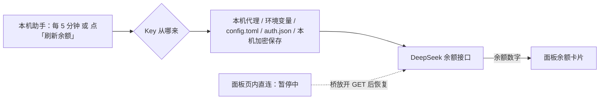

# DeepSeek Token Usage for Codex++

这是一个 Codex++ 用户脚本，不是独立后台服务。

## 工作方式

- Codex++ 启动时把脚本注入 Codex 页面；
- 脚本监听 Codex 内部的 `tokenUsage` 消息，同时兼容 fetch / XHR / WebSocket 响应；
- 1.17.4 起按 provider/model 归属收紧读取范围，只解析两类响应：主机名里带 `deepseek`
  的地址；路径为 `/chat/completions`、`/completions`、`/beta/chat/completions` 且
  **请求体里点名了 deepseek 模型**的地址（本机中转、自建代理走的就是这个路径）。
  `127.0.0.1` 上其它接口、`/responses`、其它 provider 的 completions 调用、以及
  从没出现 deepseek 模型名的 WebSocket 连接，正文一律不读（同一条连接首帧认出
  归属后，后续帧继续解析，免得漏掉流式末尾那条 usage）；
- 只记录 token 数量、模型、费用和时间，不读取聊天正文；
- 持久历史就在面板自己的本机存储里（保留 400 天、上限 5 万条），不依赖 8787 代理的
  `usage.jsonl`，也不依赖任何外部日志文件；
- Codex 启动期间，`proxy-watchdog.vbs` 会让本机助手 `tools/auto_sync_codexpp_usage.mjs`
  一直运行：每 15 秒给面板一次心跳、每 5 分钟推一次账户余额，点「刷新余额」时立刻重读；
  它只用 Codex 自己的凭据（环境变量 / `config.toml` 的 `env_key` / `~/.codex/auth.json` /
  本机 DPAPI 存储）直连 DeepSeek，**不碰本机代理**；Codex 退出后助手被停掉，
  不在系统闲置时占用资源；
- 助手代码与发布版 `helper/dstu-helper.mjs`、`helper/balance_sources.mjs` 逐字节相同
  （只差文件名和启动器），本机跑的就是用户拿到的那条主线路径：代理来源要自己设
  `DSTU_BALANCE_URL` 才启用，导入外部用量日志要自己设 `DSTU_USAGE_LOG`，两个都没设就等于关闭；
- 看门狗每 3 秒检查一次：Codex 在跑就确保助手在跑，Codex 不在就停掉。它由计划任务
  `DeepSeekProxy` 在登录时唤起，并每 5 分钟重复触发一次作为兜底，看门狗自己意外退出也能回来。
  同一个看门狗也负责你自己那套 8787 代理的启停——那是另一条线，面板不依赖它；
- 在 Codex 顶栏加入 `DeepSeek 用量` 入口，点击打开图表面板。
- 面板标题栏和左侧 `⋮⋮` 抓取条可以按住拖动，使用 transform + requestAnimationFrame
  平滑移动，位置会记住；右上角 `−` 可以把面板收成一条标题栏。
- 面板四边和四个角共 8 个方向都能拖动缩放；双击右下角恢复默认大小，尺寸会持久化。
- 图表柱/费用点支持鼠标悬浮提示，显示该节点的完整 token 与费用明细。
- 每次 Codex 启动后的第一次打开强制展开完整窗口，不使用 mini 状态；之后才记住手动收起。
- 每次 Codex 启动后打开面板，默认范围都是「今天 + 按天」，不会沿用上次选的日期或月份
  （想看别的日子点日期框，或切「按月」）。
- 收起后是一条约 47px 高的状态条，只显示当前范围的 token 用量和费用。
- 每个 token 事件会优先使用该请求携带的模型（来自 turn settings / request body /
  事件字段）；若事件没有模型，则使用最近一次检测到的活动模型作为兜底，再使用面板下拉框。
- 脚本支持热重载：新版本注入后会原地接管已有面板，旧实例发现自己不再是
  `window.__deepseekUsagePanel` 的主人就自动退休（断开 MutationObserver、取消待执行的
  刷新），不再和新版本来回重写面板内容——以前那正是「按钮全失效」的原因。这次从
  `1.15.2` 升级到 `1.16.1` 时旧实例还没有这套守卫，所以第一次升级后请完全退出 Codex
  再打开一次；之后的版本升级不需要再重启。
- `1.18.4` 重排了「账户余额 → 设置」：Key 设置与选项分组展示、长说明收进可折叠条目，
  状态行改成单行「余额同步」；状态文案也说清楚了——「读到 Key」不等于「能自动查余额」。
- `1.19.0` 在「设置」里加了「本机助手（可选）」：显示助手在不在跑，并给出一键安装 /
  卸载命令（Windows 是 PowerShell，macOS 是 `curl … | bash`）；装了助手之后
  「刷新余额」按钮会重新出现。macOS 的 Key 可以存进登录钥匙串。
- `1.19.1 / 1.19.2` 让这条助手命令在**各种 CPU 架构**上都成立：面板多了「命令给哪个系统」
  （自动识别 / Windows / macOS，选过会记住），安装脚本自己去找 node——
  Windows 认 Program Files 两套目录与 nvm-windows / Volta / Scoop / Chocolatey，
  macOS 认 Apple 芯片的 `/opt/homebrew` 与 Intel 的 `/usr/local`、MacPorts，
  `-Status` 会把「系统架构 + node 架构」一起打出来，两边对不上（例如 Apple 芯片上
  装了 x64 的 node）也能跑，只是建议换成原生版本。1.19.2 顺手修掉一个让「刷新余额」
  永远露不出来的样式冲突：装了本机助手之后，那颗按钮现在会真的回来。
- `1.19.3` 按 Codex++ 实际发布的三份安装包收口（Windows x64、macOS Intel、macOS
  Apple 芯片），不再宣传用不上的系统；安装命令默认带国内镜像兜底，粘进终端回车后
  全自动：脚本先检测这台机器上有没有 18 以上的 Node.js，有就直接用、没有才替用户装
  （Windows 先试 winget、不成退回便携版；macOS 先试 Homebrew、不成退回官方包），
  都不需要管理员权限。
- `1.19.4` 把「一键安装」做成真的：点一下，面板就把安装请求写进 Codex 对话框并直接
  发送，由应用里的 Codex 在这台电脑上执行安装脚本（同一个脚本、同一套先检测后安装），
  用户不用复制粘贴。Codex 停在别的页面、正忙（那颗键会变成「停止」）或输入框里已经有
  内容时，自动退回「复制安装命令」，效果一样；卸载也给了「让 Codex 卸载」入口。
- `1.19.5 / 1.19.6` 收口余额这块：面板不再收集 Key（1.19.6 起「填 Key」和「手动填余额」
  两组控件都撤了），余额统一由本机助手写入；助手照旧按「本机代理 → 环境变量 → config.toml
  的 env_key → ~/.codex/auth.json → 本机加密保存」的顺序自己找 Key，找不到就是读不到余额，
  面板只负责显示。
- `1.19.7` 收口面板文案与开关位置：勾选框从「设置 → 选项」挪到「账户余额」卡片
  标题行（和「账户余额」「设置」同一行），设置里不再有「选项」分组；助手说明从一段
  长文压到两行，只说「一键安装怎么装（缺 Node.js 自动补、不用管理员权限）」「命令
  按所选系统给」「Key 不用管」，同步频率等细节收进可折叠的「余额是怎么自动更新的？」。
- `1.19.8` 图表精修：柱子做成圆角柱（只磨顶端两角、柱脚保持直角），命中段带一点纵向
  渐变；费用折线改平滑曲线、线下加了淡淡一层渐变；用量最高的那根柱和费用最高点会自动
  标出数值，不用再自己对着坐标轴估。
- `1.19.9` 修掉「别人的消耗算到某一天头上」：当日消耗改成按**当天自己的快照逐笔累加**，
  跨零点的那一小段按小时比例分给相邻两天，不再借用上一个有记录日的收盘余额（旧算法在
  9/17 快照只记到 14:55 时，把 14:55→24:00 的 ¥524 整段算进了 9/18）。相邻两次快照
  隔得久（> 3 小时）时，这段分摊标成 `≈`。同时本机助手开始写自己的余额流水
  `balance.log`，并会自动读它 + 桌面的 `balance\balance.log` 回填面板，把断档补成真实数据。
  表格第 4 列也从「费率估算」正名为「本机估算」（那是本机 token 按官方费率算的钱，
  和账户级余额消耗不是一回事）。
- `1.19.10` 修「启用」勾选框跟着应用升级一起哑掉：Codex 26.915 给原生 checkbox 设了
  `appearance: none` + 零尺寸，卡片标题行那颗框被压成 2×2，"启用"只剩文字。现在这颗框
  自带尺寸、边框和对勾，不再依赖应用的默认样式，应用再升级也不会消失。

## 余额记录

「账户余额」卡片显示当前余额、今日消耗、昨日消耗、本月消耗，以及每天的收盘余额 /
余额消耗 / 本机估算对照表。

余额这块现在由**本机助手**负责：点面板「设置 → 本机助手」的「一键安装（交给
Codex）」装一次，Codex 运行时它每 5 分钟查一次（它在本机用 GET，读得到），点
「刷新余额」立刻补一次。**不用用户自己填 Key**：助手按「余额来源」表的顺序找本机
已有的 Key（`~/.codex/auth.json` 就是 Codex 自己保存的那把），前几条都找不到时，
余额就会读不到（面板上没有填 Key 的地方）。

面板页里那条直连通道仍然暂停中（Codex++ 的网络桥只放行 POST，DeepSeek 查余额的
接口只认 GET，两者对不上，点它必然失败）。实现代码一行没删——把脚本里的
`BRIDGE_BALANCE_QUERY_ENABLED` 改回 `true` 就整体恢复。

现在能拿到余额的路子一共四条，面板都会记成「余额快照」：

| 路子 | 在哪 | 现在能不能用 |
| --- | --- | --- |
| 本机助手推送 | `helper/dstu-helper.mjs`（本机 `tools/auto_sync_codexpp_usage.mjs`）：Codex 运行期间每 5 分钟推一次，点「刷新余额」立刻补一次；每读到一次余额还会追加一行本机流水 `balance.log`（助手目录里） | 点面板「设置 → 本机助手」的「一键安装（交给 Codex）」，由 Codex 在这台电脑上装一次即可；也可以点「复制安装命令」自己粘（Windows PowerShell、macOS 终端，命令按系统给、能手动切）。缺 Node.js 会自动补；装完随 Codex 自动启停；面板不依赖它，没装也不会提示 |
| 余额日志回填 | 助手自己读 `balance.log`（助手目录、桌面 `balance\balance.log` 等），把缺的快照补进面板 | 装了助手就自动做：启动时整段补一次，之后每 15 分钟补增量 |
| 历史快照导入（手动） | `node tools/import_balance_log.mjs <balance.log>` | 随时可用，一次性补齐旧记录（不想装助手时用这个） |
| 面板直连查询 | 借 Codex++ 宿主桥打 DeepSeek 余额接口 | 暂停中：桥只放行 POST、接口只认 GET；代码保留，桥放开 GET 自动恢复 |

面板上没有手填余额与填 Key 的入口：余额统一由本机助手写入，等 Codex++ 放开 GET
（或你用的中转站有 POST 版余额接口）时面板直连也会接上。

面板上没有 Key 输入框：1.19.6 起余额完全交给本机助手，Key 由助手在本机自己找（见上面
「余额来源」那张表），面板只负责显示助手推来的数字。宿主桥那条直连通道仍然暂停中（桥只
放行 POST、接口只认 GET），实现代码保留；等桥放开 GET 时它只用 Codex 配置里那把 Key，
不再需要面板收集 Key。

查询频率（桥能用时）：打开面板时一次，之后每 15 分钟一次，两次之间至少隔 30 秒，
页面在后台时不查。现在桥不能用，这段自动查询处于暂停状态；余额由本机助手负责（见上面的路子表）。

不想经过面板，也可以在终端里存这把 Key（同样的加密文件、同样的 DPAPI）：

```powershell
powershell -NoProfile -ExecutionPolicy Bypass -File tools\set_balance_key.ps1           # 提示输入，输完回车
"sk-..." | powershell -NoProfile -ExecutionPolicy Bypass -File tools\set_balance_key.ps1  # 或直接从管道喂进去
powershell -NoProfile -ExecutionPolicy Bypass -File tools\set_balance_key.ps1 -Status   # 只看有没有存过
powershell -NoProfile -ExecutionPolicy Bypass -File tools\set_balance_key.ps1 -Clear    # 删掉本机保存的 Key
```

这个文件里存的是 DPAPI 加密串（CurrentUser 作用域），所以只有本机、本 Windows 账户
能解开：拷到别的机器或别的账户上都是一堆没用的密文，明文 Key 不落盘。助手调它时把 Key
走标准输入传进去，不出现在命令行参数里，进程列表也看不到。



宿主桥目前只允许 **POST**（实测返回 `LLM Bridge 仅支持 POST 请求`），而 DeepSeek 的余额
接口只认 **GET**（实测：POST 打过去是 HTTP 405）；面板直连 `fetch` 也被 CSP 拦掉，
两条路都不通。所以按钮先收起来，卡片上写的是「自动查询等 Codex++ 放开 GET 后恢复」，
不提任何助手。等 Codex++ 放开 GET（或 Key 指向一个 POST 也能返回余额的中转站）时，
同一套代码不用改就会自动生效。

- 余额只认**查到的数字**（官方接口、历史导入），面板不会用本机 token 用量去
  推算或扣减余额：同一个 DeepSeek 账户可能多台机器共用，按本机用量算出来的余额会偏；
  卡片上的「今日消耗 / 本月消耗」是把**当天自己的快照逐笔累加**得到的，仍然是查到的值；
- 面板的余额由仓库 `helper/` 里那个助手提供：它推来的数字进卡片；没装它时卡片是空的，
  面板会提示去点「一键安装」；
- 面板不收集也不保存任何 Key（1.19.6 起连输入框都没有了）：Key 由助手在自己的进程里读，
  Windows 用 DPAPI、macOS 用钥匙串加密保存，不进统计、不写日志、也不随脚本上传；
- 不想要余额功能，把「账户余额」卡片标题行上的「启用」勾去掉即可，面板会彻底跳过余额请求；
- 卡片的状态行只当短提示（约 45 秒后自动消失），常态显示的是数据来源，例如
  「面板直连 · 20 秒前更新」或「余额来源：本机代理 · 20 秒前同步」；
- 当日消耗怎么分：快照按时间排序，相邻两次之间的余额差（下降=消耗、上升=充值）按
  这段时间落在哪几天分摊，跨零点的那一小段按小时比例分给相邻两天；也就是说**每一天
  只算属于自己的那部分**，别的时间段的消耗不会被整段挪过来；
- 相邻两次快照隔得久（> 3 小时：助手没在跑、机器关机）时，这段只能按时间比例估算，
  表里会带一个 `≈`；助手读到余额日志后会用真实快照替换掉这段估算；
- 表里第 3 列「余额消耗」是**账户级**的（账号里其他人花的也算），第 4 列「本机估算」
  才是本机 Codex 按官方费率算的钱，两列不要混着看；
- 图表在按月模式下悬浮到某一天，也会显示该天的收盘余额和余额消耗。
- 余额日志会自动回填：助手每读到一次余额都会往自己的 `balance.log` 追加一行，同时
  回读自己的和桌面上的 `balance\balance.log`（格式：每行 `2026-09-20 15:00:03,8050.12`，
  后面还可以跟别的列）补进面板余额历史。重复快照按「同一时刻、或同一分钟内同一金额」
  跳过，0 元行按查询失败跳过。没有装助手时，也可以手动导一次：

  ```powershell
  node tools\import_balance_log.mjs <balance.log 的路径>            # 导完即退出
  node tools\import_balance_log.mjs <balance.log 的路径> --wait 60  # 面板还是旧版时，等 Codex 重启后自动导入
  ```

- 余额快照来源会标在卡片上：`自动获取`（接口/助手实时读）、`历史导入`（balance.log）；
- 面板直连的请求量很小：打开面板一次 + 每 15 分钟一次，页面在后台或余额功能关掉时不发；
  本机如果跑着旧助手，它的 5 分钟轮询与代理 10 分钟缓存都不受影响；

## 安装位置

余额助手（可选，发布包里不需要它）用到的几个本机文件，都在本仓库 `tools/` 下：

```text
tools/balance_sources.mjs      余额来源查找与请求（可单独测试）
tools/auto_sync_codexpp_usage.mjs  随 Codex 启停的助手主程序
tools/set_balance_key.ps1      手工保存 / 查看 / 清除本机加密 Key
tools/test_balance_sources.mjs 余额来源的自动化检查（29 项）
```

手工保存 Key（不经过面板，直接在本机加密存好）：

```powershell
powershell -NoProfile -ExecutionPolicy Bypass -File tools\set_balance_key.ps1 -Status
"sk-..." | powershell -NoProfile -ExecutionPolicy Bypass -File tools\set_balance_key.ps1
powershell -NoProfile -ExecutionPolicy Bypass -File tools\set_balance_key.ps1 -Clear
```

```text
C:\Users\wuhan\AppData\Roaming\Codex++\user_scripts\deepseek-token-usage.js
```

注册文件：

```text
C:\Users\wuhan\AppData\Roaming\Codex++\user_scripts.json
```

对应的注册项：

```json
{
  "enabled": true,
  "scripts": {
    "user:deepseek-token-usage.js": true
  }
}
```

## 历史数据同步

面板支持 `window.__deepseekUsagePanel.replaceProxyRecords(records)` 导入外部记录。
**这一步是可选的**：面板平时不读任何外部日志，只有想把以前代理记下的历史补回来时才做。
在 Codex 运行时执行，并显式给出那份 JSONL 的路径：

```powershell
.\sync-codexpp-usage.ps1 <usage.jsonl 的路径>
```

该命令只读这个文件、不发网络请求。

## 面板接口

面板自己查余额的那套 API（`queryBalance()` / `useCodexConfigKey()` / `getBalanceKeyState()`）都还在，
但面板上已经没有 Key 输入区（1.19.6 起），这几个口子留给自动化和「桥放开 GET」之后的直连用；
平时余额走助手通道（`recordBalance()` + `ackBalanceSync()`）。

```js
window.__deepseekUsagePanel.queryBalance()        // 立刻查一次，返回 {ok, value, currency, method}
window.__deepseekUsagePanel.useCodexConfigKey()   // 读 Codex 配置里的 Key（读到就顺手查一次）
window.__deepseekUsagePanel.getBalanceKeyState()  // { hasKey, label, tail, mode, remember, bridge }
window.__deepseekUsagePanel.setBalanceKeyMode('auto' | 'manual')
```

助手通道（可选）：

```js
window.__deepseekUsagePanel.getBalanceSync()      // 刷新请求、心跳、上次推送时间
window.__deepseekUsagePanel.ackBalanceSync(info)  // 助手回报心跳 / 推送结果
window.__deepseekUsagePanel.recordBalance(v, s, o) // 写入一条余额快照
window.__deepseekUsagePanel.getBalances()         // 读取全部余额快照
window.__deepseekUsagePanel.importBalanceSnapshots(entries) // 批量导入历史快照（去重、丢弃 0 元）
window.__deepseekUsagePanel.requestBalanceRefresh() // 登记一次刷新请求（不发网络）
```

助手每轮轮询用到的新字段：

```js
// 读
const sync = window.__deepseekUsagePanel.getBalanceSync();
sync.enabled        // 用户在面板里是否开着余额统计
sync.source         // 'auto' | 'proxy' | 'key'
sync.pendingKey     // 用户刚填、等待助手加密保存的 Key（只存在于页面内存）
sync.keyRequestAt   // 面板请求保存 Key 的时间戳
sync.keyClearAt     // 面板请求清除本机 Key 的时间戳

// 写
window.__deepseekUsagePanel.ackBalanceSync({
  pushed: true,             // 这次是否成功推了余额
  hasAuth: true,            // 代理是否已经有鉴权
  hasKey: true,             // 是否找到可用 Key
  sourceUsed: 'auth',       // 'proxy' | 'env' | 'auth' | 'store'
  keySaved: true,           // 已把 pendingKey 加密存好 → 面板立刻从内存清掉
  keyCleared: true,         // 已删掉本机保存的 Key
  note: '...',              // 状态行上的一句话
});
```
